# ♟️ TIME GAMBIT
> **The High-Agency Scheduling Architect.**
> *A Physics-Informed, Deterministic Agent for the Chaos of Time.*

[](https://devfest.google.com)
[](https://github.com/r-baruah)
[](https://devfest.google.com)
[](https://langchain.com)

---

## 🚀 Mission Statement

**Time Gambit** solves the "Calendar Tetris" problem. It is not just a chatbot; it is a **Deterministically Constrained, Probabilistically Reasoning Agent**.

Most scheduling assistants hallucinate slots or fail to understand context. Time Gambit treats your schedule as a logic puzzle. It negotiates, plans, and executes calendar operations by reasoning about urgency, priority, and physical time constraints (working hours, lunch breaks) before ever touching your data.

---

## 🧠 System Architecture

The core of Time Gambit is built on a **Stateful Multi-Agent Graph** architecture using LangGraph. It employs a **Router-Solver Pattern** to ensure precision.

```mermaid
graph TD
    User[User Input] --> Router{Router Agent}
    Router -->|Schedule Request| Check[Check Completeness]
    Router -->|Query| Solver[Solver Agent]
    Router -->|Chitchat| Synthesizer[Synthesizer Agent]

    Check -->|Missing Info| Clarify[Clarification Agent]
    Clarify -->|Ask User| User

    Check -->|Complete| Solver
    Solver -->|1. Parse Dates| NLP[Natural Language Parsing]
    Solver -->|2. Fetch Events| GCal[Google Calendar API]
    Solver -->|3. Solve Constraints| Logic[Constraint Engine]
    Logic -->|Slot Found| Book[Book Slot]
    Logic -->|Conflict| Synthesizer
    Book --> Synthesizer
    Synthesizer -->|Final Response| User
```



### The Agentic Workflow

1.  **🔵 Router Agent**: The gatekeeper. It analyzes semantic intent (Schedule vs. Query vs. Chat) and routes accordingly.
2.  **🟢 Clarification Agent**: The context-aware interrogator. If you say "Schedule a meeting," it halts execution and asks "With whom and for how long?" It maintains conversation state.
3.  **🟡 Solver Agent**: The execution engine. It acts as the "Physics Engine" of your calendar:
    *   **Temporal Parsing**: Converts natural language to ISO timestamps.
    *   **Constraint Satisfaction**: Respects `USER_WORKING_HOURS` and `LUNCH_BREAKS`.
    *   **Conflict Detection**: Real-time checking against existing Google Calendar events.
4.  **🟣 Synthesizer**: The voice. It takes raw data or success states and crafts a human-friendly response.

---

## 🤖 Kairos: The Telegram Interface

**Kairos (@Kairosengine_bot)** is the primary interface for Time Gambit, designed for low-friction, high-availability usage.

### Key Features
1.  **The "Auth-First" Barrier**:
    *   Kairos enforces security at the door. No commands are processed until the user is authenticated via OAuth 2.0.
    *   Unauthenticated users are greeted with a secure "Login with Google" link.
    
2.  **BYOK (Bring Your Own Key) Architecture**:
    *   **Privacy-Maximalist Mode**: Users can optionally provide their own Google Gemini or OpenAI API keys.
    *   **Default Mode**: Users can skip and use the hosted system's credentials.

3.  **Smart Forwarding**:
    *   Kairos acts as a bridge, forwarding authorized messages to the Backend Router and delivering the Agent's reasoned responses back to the user.

---

## 🛠️ Technology Stack

### **Backend Core**
-   **Python 3.10+** (FastAPI)
-   **LangGraph** (State Machine / Orchestration)
-   **LangChain** (LLM Interface)
-   **Pydantic** (Data Validation)

### **Interfaces**
-   **Telegram Bot**: `python-telegram-bot` (Async)
-   **Frontend**: Next.js 14, React 18, Tailwind CSS (for Admin/Settings)

### **Integration**
-   **Google Calendar API v3**
-   **OpenRouter API** (Support for GPT-4o, Gemini Pro, Claude 3.5)

---

## 🏗️ Installation & Setup

### 1. Backend Initialization

```bash
# Clone and enter directory
cd backend

# Create virtual environment
python -m venv venv
source venv/bin/activate  # Windows: venv\Scripts\activate

# Install dependencies
pip install -r requirements.txt

# Configure Environment
cp .env.example .env
# Edit .env with your keys:
# OPENROUTER_API_KEY, GOOGLE_CLIENT_ID, GOOGLE_CLIENT_SECRET, TELEGRAM_BOT_TOKEN
```

### 2. Bot Initialization

The Bot runs as a service within the backend ecosystem.

```bash
# Run the Bot Service
python -m services.kairos_bot.main
```

### 3. Frontend Initialization (Optional Dashboard)

```bash
cd frontend
npm install
npm run dev
```

---

<div align="center">
    <sub>Built with ❤️ and ☕ for DevFest Goa 2026 by Ripuranjan Baruah</sub>
</div>
