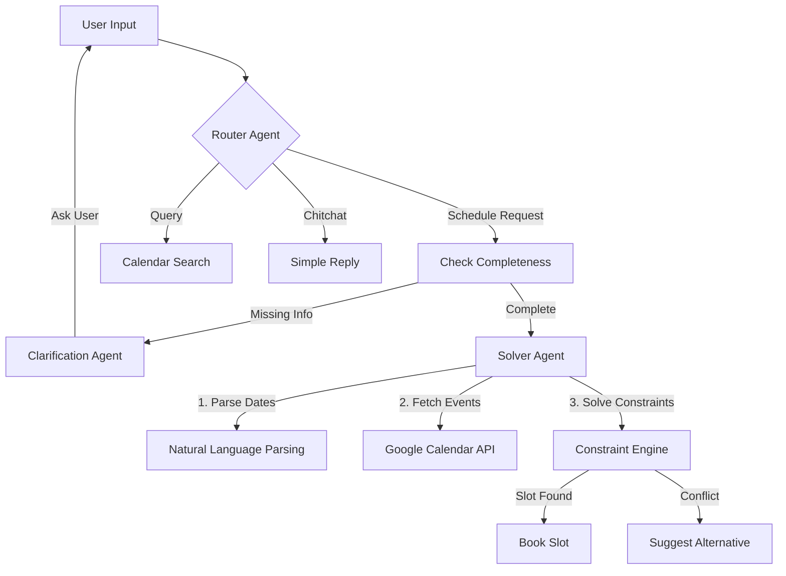

# ♟️ TIME-GAMBIT
> **The High-Agency Scheduling Architect.**

[](https://devfest.google.com)
[](https://github.com/r-baruah)
[](https://devfest.google.com)
[](https://langchain.com)

---

## 🚀 Mission Statement

**Time-Gambit** solves the "Calendar Tetris" problem. It is not just a chatbot; it is a **Deterministically Constrained, Probabilistically Reasoning Agent**.

Most scheduling assistants hallucinate slots or fail to understand context. Time-Gambit treats your schedule as a logic puzzle. It negotiates, plans, and executes calendar operations by reasoning about urgency, priority, and physical time constraints (working hours, lunch breaks) before ever touching your data.

---

## 🧠 System Architecture

The core of Time-Gambit is built on a **Stateful Multi-Agent Graph** architecture using LangGraph.



### The Agentic Workflow

1.  **🔵 Router Agent**: The gatekeeper. It analyzes semantic intent to route requests to the correct sub-system, filtering out noise.
2.  **🟢 Clarification Agent**: The context-aware interrogator. It refuses to guess. If you say "Schedule a meeting," it asks "With whom and for how long?" It maintains state across multiple turns.
3.  **🟡 Solver Agent**: The execution engine. It acts as the "Physics Engine" of your calendar:
    *   **Temporal Parsing**: Converts "next Tuesday morning" to ISO timestamps.
    *   **Constraint Satisfaction**: Respects `USER_WORKING_HOURS` and `LUNCH_BREAKS`.
    *   **Conflict Detection**: Real-time checking against existing Google Calendar events.
4.  **🟣 Tool Implementation**: Direct OAuth 2.0 integration with Google Calendar for read/write operations.

---

## ⚡ Key Capabilities

| Feature | Description |
| :--- | :--- |
| **🧠 Cognitive Parsing** | Understands complex inputs: *"Hackathon on the 24th from 10am for 2 days."* |
| **🛡️ Privacy First** | Frontend-initiated OAuth flow ensures tokens are handled securely. |
| **🛑 Hallucination Guard** | The agent will **never** book a slot without having all necessary details (Title, Date, Duration). |
| **⚙️ Dynamic Config** | User-settable constraints for Working Hours (09:00-17:00) and Lunch Breaks. |
| **🔌 Model Agnostic** | Powered by OpenRouter, supporting GPT-4o, Claude 3.5 Sonnet, Gemini Pro, and Llama 3. |

---

## 🛠️ Technology Stack

### **Backend Core**
-   **Python 3.10+** (FastAPI)
-   **LangGraph** (State Machine / Orchestration)
-   **LangChain** (LLM Interface)
-   **Pydantic** (Data Validation)

### **Frontend Experience**
-   **Next.js 14** (App Router)
-   **React 18** (Client Components)
-   **Tailwind CSS** (Styling)
-   **Lucide-React** (Iconography)

### **Integration**
-   **Google Calendar API v3**
-   **OpenRouter API**

---

## 🏗️ Installation & Setup

### 1. Backend Initialization

```bash
# Clone and enter directory
cd backend

# Create virtual environment
python -m venv venv
source venv/bin/activate  # Windows: venv\Scripts\activate

# Install dependencies
pip install -r requirements.txt

# Configure Environment
cp .env.example .env
# Edit .env with your keys:
# OPENROUTER_API_KEY, GOOGLE_CLIENT_ID, GOOGLE_CLIENT_SECRET
```

### 2. Frontend Initialization

```bash
cd frontend

# Install packages
npm install

# Start development server
npm run dev
```

### 3. Launch

Access the application at `http://localhost:3000`.
1.  Click the **⚙️ Settings** icon to configure your constraints.
2.  Authenticate with **Google Calendar**.
3.  Begin scheduling.

---

<div align="center">
    <sub>Built with ❤️ and ☕ for DevFest Goa 2026</sub>
</div>

